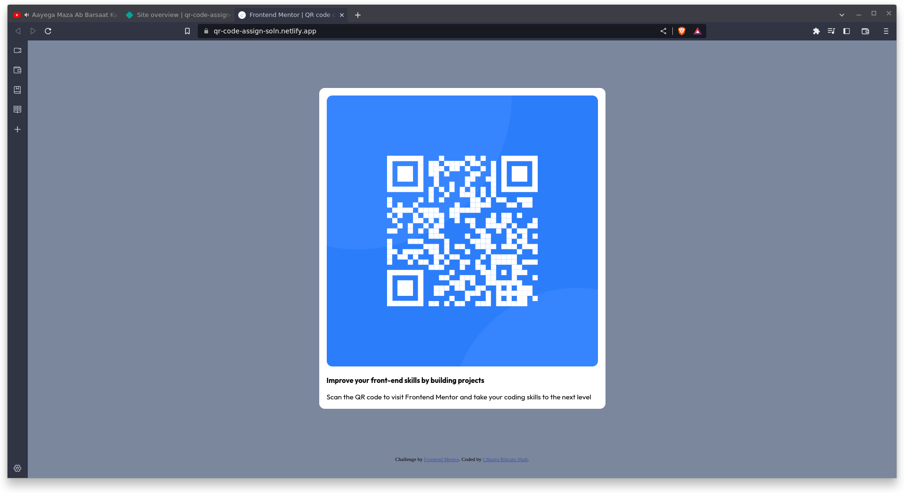

# Frontend Mentor - QR code component solution

This is a solution to the [QR code component challenge on Frontend Mentor](https://www.frontendmentor.io/challenges/qr-code-component-iux_sIO_H). Frontend Mentor challenges help you improve your coding skills by building realistic projects. 

## Table of contents

- [Overview](#overview)
  - [Screenshot](#screenshot)
  - [Links](#links)
- [My process](#my-process)
  - [Built with](#built-with)
  - [What I learned](#what-i-learned)
  - [Continued development](#continued-development)
  - [Useful resources](#useful-resources)
- [Author](#author)
- [Acknowledgments](#acknowledgments)

**Note: Delete this note and update the table of contents based on what sections you keep.**

## Overview

### Screenshot

#### Desktop View


#### Mobile View


### Links

- Solution URL: [Add solution URL here](https://your-solution-url.com)
- Live Site URL: [Add live site URL here](https://qr-code-assign-soln.netlify.app/)

## My process

### Built with

- Semantic HTML5 markup
- CSS custom properties
- Flexbox
- CSS Grid


### What I learned

I learned to make image responsibe for different screen width-sizes using max-width property


```html
 <div class="image-container">
    
  </div>
```
```css
.image-container{
      height: 100%;
      width: 100%;
      
    }

.image-container img{
      object-fit: cover;
      border-radius: 12px;
      max-width: 100%;
      width: auto;
    }
```

I also learned show to wrap content inside p tag  using flexbox

```css
.main-container p{
      display: flex;
      justify-content: flex-start;
      flex-wrap: wrap;
      align-items: center;
      font-family: 'Outfit',sans-serif;
      font-size:15px ;

    }

```

### Continued development

I will focus more on using grid and advance concept such as animation and transition 
I will make more complex design using gsap and framer motion with react .

### Useful resources

- [MDN Documentation](https://developer.mozilla.org/en-US/) - This guided me to write css syntax clearly.

- [W3schools](https://www.w3schools.com/) - This helped me while looking for different value of flexbox attributes.


## Author

- Website - [Chhatra Bikram Shah](https://my-personal-porfolio-git-main-shahchhatru.vercel.app/)
- Frontend Mentor - [@shahchhatru](https://www.frontendmentor.io/profile/shahchhatru)
- Linkdin - [chhatra ](https://www.linkedin.com/in/chhatra-bikram-shah)

## Acknowledgments

I really appreciate frontendmentor for proving us with such a platform to enhance my front end skills

